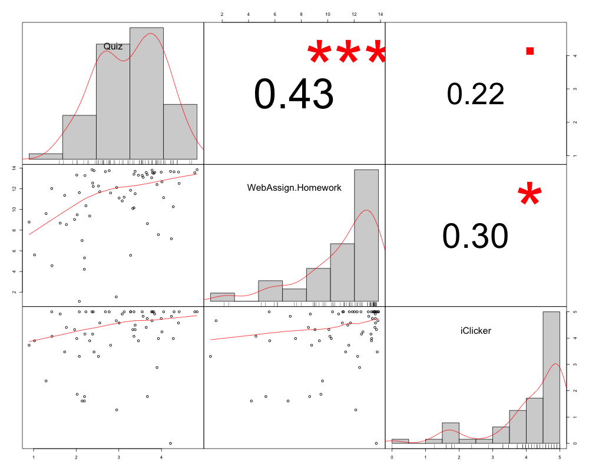

# D2L-GradeReport

Author: **Thomas Gredig**

This project creates grade reports based on downloaded CSV files from the Desire2Learn (BeachBoard) platform.

## Configuration

Download the full grade books from Desire2Learn and store them in a directory over time. The filenames should not be alterned to retain the information stored in the filenames. The timeline is generated by downloading the gradebook over time, for example weekly, etc.

- Create and Configure `myConfig.R` if needed

## Grade Correlations

Make a graph of the correlations between grade items. If there is a category, then we will use the category instead of all the individual items. 

- run `D2L.grade.correlations.R`
- creates a graph and table

Example output:

## Student Report

Simple student report with mean values for each category

- run `report.Student.R` and modify last name

